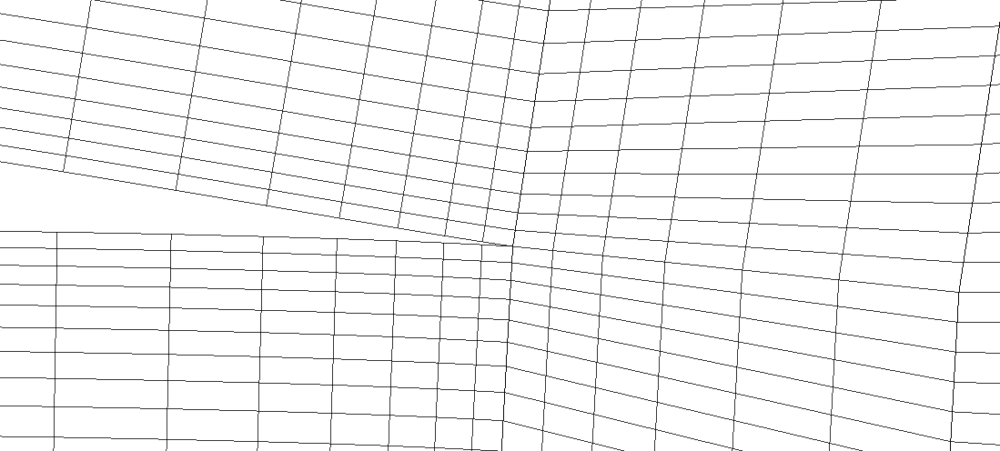

# PyAero 

[](https://pyaero.readthedocs.io/en/latest/?badge=latest)
[](https://en.wikipedia.org/wiki/MIT_License)


PyAero is an open-source airfoil contour analysis and CFD meshing tool written in Python. The graphical user interface is written in [Qt for Python](https://www.qt.io/qt-for-python).

## Features

 - Load and display airfoil contour files
 - Airfoil splining and refining
   - Get a smooth contour and sufficient contour points
   - Refine leading and trailing edge resolution
   - Prepare contour for meshing
   - Automatic calculation of leading edge radius
   - Point distribution on spline used as mesh distribution
 - Automatic generation of block-strcuctured mesh
   - Currently single element C-type mesh
   - Strictly orthogonal mesh in the vicinity of the airfoil
   - Mesh resolution control for airfoil, leading edge, trailing edge and windtunnel
 - Sharp or blunt trailing edges
 - Mesh smoothing (to be improved)
 - Mesh export
   - [AVL FIRE](https://www.avl.com/fire) (.flma)
   - [SU2](https://su2code.github.io/) (.su2)
   - [GMSH](http://gmsh.info) (.msh)
   - Automatic definition of boundary elements (edges, faces)
     - Airfoil, inlet, outlet, symmetry
 - Simple aerodynamic analysis using [AeroPython](http://nbviewer.ipython.org/github/barbagroup/AeroPython/blob/master/lessons/11_Lesson11_vortexSourcePanelMethod.ipynb)
 - Airfoil contour analysis (gradient, curvature and curvature circle)
 - NOT YET IMPLEMENTED: Advanced aerodynamic analysis
   - Linking to open source CFD software (e.g. SU2)

## Sample screenshots


**PyAero GUI at a glance**
<br><br>


**Example mesh around RAE2822 airfoil**
<br><br>


**Example mesh around RAE2822 airfoil - Leading Edge**
<br><br>


**Example mesh around RAE2822 airfoil - Trailing Edge (with finite thickness)**
<br><br>


**Example mesh with a sharp Trailing Edge**
<br><br>


**Example mesh around MAKAROV KPS airfoil as used in the CFD code AVL-FIRE.**
<br><br>


**Velocity field (RE=50000) around MAKAROV KPS airfoil using the CFD code AVL-FIRE.**
<br><br>


**Turbulence kinetic energy field (RE=50000) around MAKAROV KPS airfoil using the CFD code AVL-FIRE.**
<br><br>


**Unsteady 3D calculation of the RG14 airfoil using the CFD code AVL-FIRE.**
<br>
**RE=330000, AOA=2°, 20 million cells.**
<br>
**Laminar calculation: CD=0.0079, CL=0.371**
<br>
**LES calculation (subgrid scale model: Kobayashi CSM): CD=0.0078, CL=0.362**
<br><br>

## Documentation

The PyAero documentation can be found at the following link:

**[http://pyaero.readthedocs.io](http://pyaero.readthedocs.io)**

The documentation is automatically generated using the markdown files in the [docs](https://github.com/chiefenne/PyAero/tree/master/docs) folder via [Sphinx](http://www.sphinx-doc.org/en/stable/index.html).

## Dependencies

 - [Python 3.x](https://www.python.org/)
 - [Qt for Python (PySide6)](https://www.qt.io/qt-for-python)
 - [Numpy](http://www.numpy.org/)
 - [Scipy](https://www.scipy.org/)
 - [meshio](https://github.com/nschloe/meshio)

At the moment no binary is available for Windows.

## Download

### Option 1: Download source version using Git:
The $ symbol represents the prompt at command shell. It is not part of the command.

```bash
$ cd anywhere_on_your_computer
$ git clone https://github.com/chiefenne/PyAero.git
```

### Option 2: Download source version as a ZIP file:

From the [PyAero GitHub repository](https://github.com/chiefenne/PyAero). There is on the upper right side a green pull down menu "Clone or download". Click on it and then click "Download ZIP". You get a file "PyAero-master.zip" which you store anywhere on your computer.

```bash
$ cd anywhere_on_your_computer
$ unzip PyAero-master.zip
```

## Installation

After cloning from Git, or downloading and unzipping, set the environment variable for the PyAero installation path.

### Linux and Cygwin

```bash
$ setenv PYAEROPATH path_to_your_installation
```

Run PyAero using:

```bash
$ python $PYAEROPATH/src/PyAero.py
```

To simplify the command, set an *alias*.

```bash
$ alias pyaero  "python $PYAEROPATH/src/PyAero.py"
```

Then start PyAero using simply:

```bash
$ pyaero
```

To keep everything stored across sessions, you might want to add PYAEROPATH and the *alias* command to your *~.bashrc, ~/.profile* or similar depending on your environment.


## Qt for Python version (PySide2)

PyAero version based on the **Qt for Python (alias PySide2)** GUI API

**Reasoning for going with Qt for Python**

PyAero started based on the PyQt4 which for me was the API to go at the time when I started development. PyAero two years ago achieved an 80% state.

After a small creative break I decided to upgrade to PyQt5 and continue development. I soon realized that the PyQt5 documentation lacks information, i.e. there were only links to the Qt C++ documentation and no Python related docs, I had the feelig that the PyQt5 development probably stagnates.

Short online research revealed to me that meanwhile Qt themselves are developing now **Qt for Python (alias PySide2)** which is based on the legacy Pyside API. This made me think that it is possibly best to go with Qt for Python as it is tightly coupled to Qt.

## For the brave

<a href='https://ko-fi.com/G2G6143T6' target='_blank'></a>

Andreas Ennemoser – andreas.ennemoser@aon.at

Distributed under the MIT license. See [LICENSE](https://raw.githubusercontent.com/chiefenne/PyAero/master/LICENSE) for more information.
